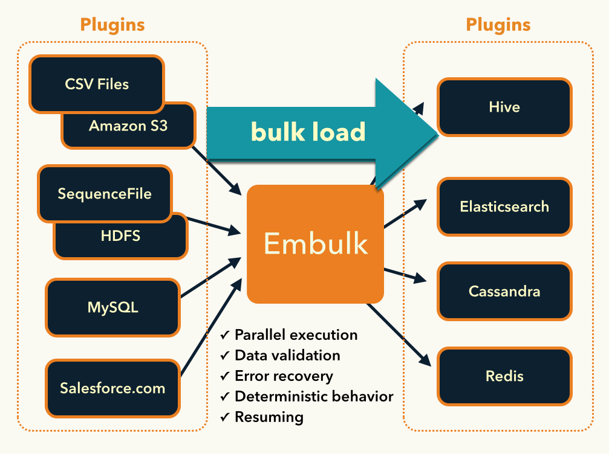

.. Embulk documentation master file, created by
   sphinx-quickstart on Fri Feb 13 14:52:36 2015.
   You can adapt this file completely to your liking, but it should at least
   contain the root `toctree` directive.

Embulk
==================================

.. image:: _static/embulk-logo-v2/embulk-logo-v2-sq-tr-small.png
   :width: 128px
   :target: https://github.com/embulk/embulk

Highlights
-----------

* Embulk's announcement mailing list (read-only) is ready. Please feel free to subscribe! Embulk core members post important updates such as **key releases**, **compatibility information**, and **feedback requests to users**.

  * `Embulk-announce <https://groups.google.com/forum/#!forum/embulk-announce>`_

What's Embulk?
------------------

Embulk is a open-source bulk data loader that helps data transfer between various databases, storages, file formats, and cloud services.

Embulk supports:

* Automatic guessing of input file formats
* Parallel & distributed execution to deal with big data sets
* Transaction control to guarantee All-or-Nothing
* Resuming
* Plugins released on RubyGems.org

You can define a bulk data loading using combination of input and output plugins:

For example, `this tutorial <recipe/scheduled-csv-load-to-elasticsearch-kibana5.html>`_ describes how to use **file** input plugin with **csv** parser plugin and **gzip** decoder plugin to read CSV files, and **elasticsearch** output plugin to load the records to Elasticsearch.

Documents
------------------

* `Quick Start <https://github.com/embulk/embulk#quick-start>`_

  * `Linux <https://github.com/embulk/embulk#linux--mac--bsd>`_

  * `Mac OS X <https://github.com/embulk/embulk#linux--mac--bsd>`_

  * `Windows <https://github.com/embulk/embulk#windows>`_

.. toctree::
   :maxdepth: 2

   recipe

* `List of Plugins by Category <http://plugins.embulk.org/>`_

  * `Input plugins <http://plugins.embulk.org/#input>`_

  * `Output plugins <http://plugins.embulk.org/#output>`_

  * `File parser plugins <http://plugins.embulk.org/#file-parser>`_

  * `File decoder plugins <http://plugins.embulk.org/#file-decoder>`_

  * `File formatter plugins <http://plugins.embulk.org/#file-formatter>`_

  * `Filter plugins <http://plugins.embulk.org/#filter>`_

  * `File encoder plugins <http://plugins.embulk.org/#file-encoder>`_

  * `Executor plugins <http://plugins.embulk.org/#executor>`_

.. toctree::
   :maxdepth: 3

   built-in

   logo

For developers
---------------

* `Github <https://github.com/embulk/embulk>`_

* `JavaDoc <javadoc/index.html>`_

* `RDoc <rdoc/_index.html>`_

* `Embulk Input Plugin Development Guide <https://docs.google.com/document/d/1oKpvgstKlgmgUUja8hYqTqWxtwsgIbONoUaEj8lO0FE/edit?usp=sharing>`_

* `Other resources for developers <developers/index.html>`_

.. toctree::
   :maxdepth: 3

   customization

Change Logs
------------

Change Logs / Release Notes are in Git annotated tags. Find them at: `GitHub Releases <https://github.com/embulk/embulk/releases>`_
